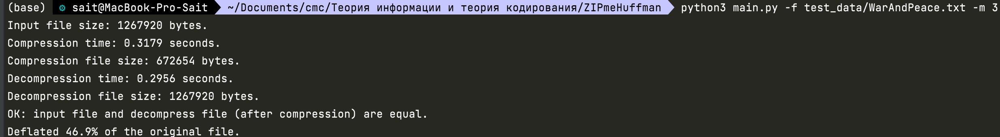
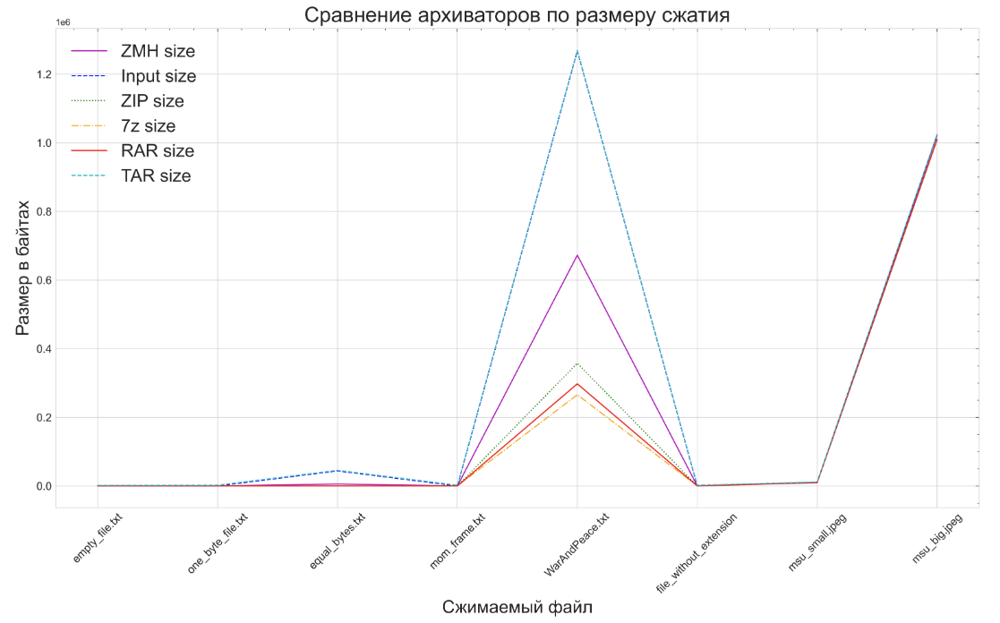
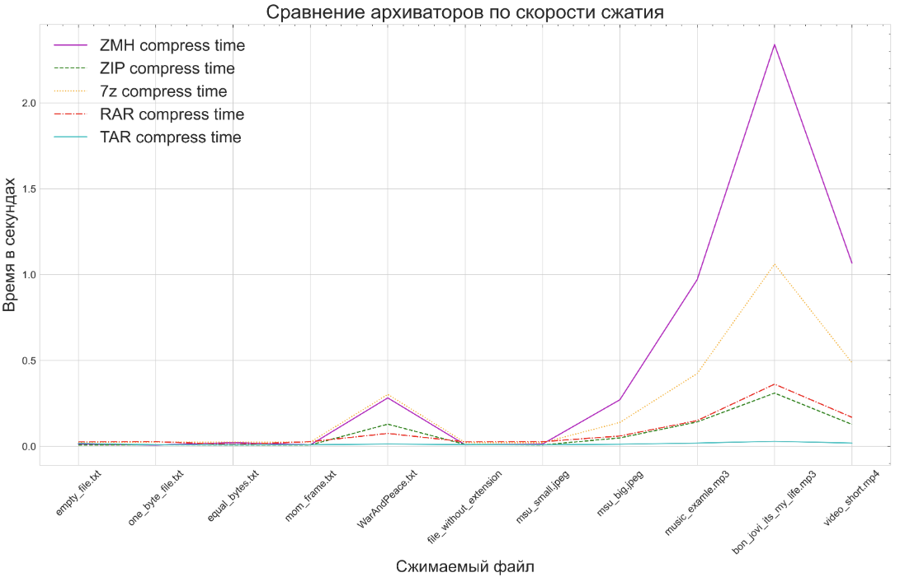
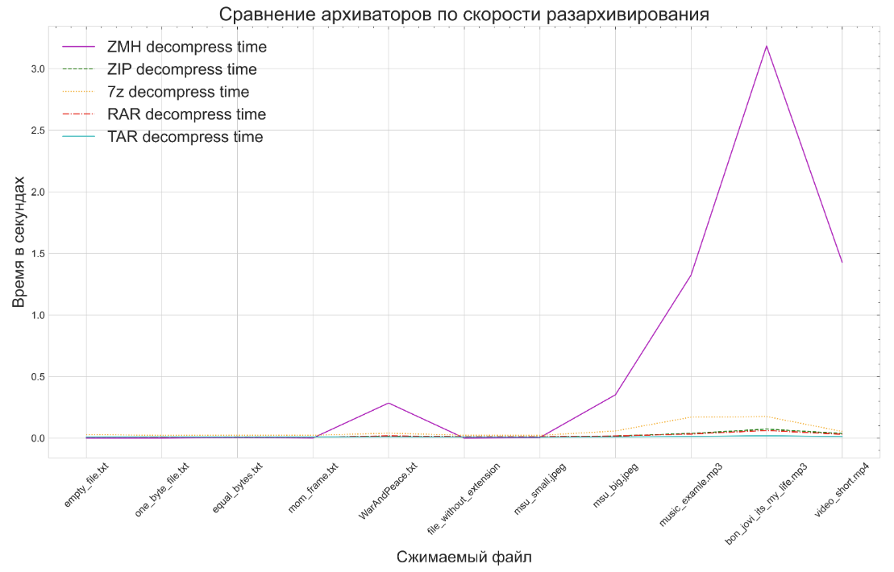

# 🗃 Использование оптимальных кодов для сжатия данных: ZIPmeHuffman

**🎓 Курс:** [Теория информации и теория кодирования](https://istina.msu.ru/courses/teachings/285891508/)  
**👨🏼‍🏫 Преподаватель:** *[Чижов Иван Владимирович](https://istina.msu.ru/profile/ivchizhov/)*  
**👨🏻‍💻 Выполнил:** Шарипов Саит, группа 519/2 
***

## 📝 Краткое описание задания:
Требуется реализовать программу сжатия данных по методу Хаффмана. Программа должна работать в двух режимах:
1. На вход подаётся бинарный файл. Программа сжимает файл и сохраняет его в расширении `zmh`.
2. На вход подаётся файл с расширением `zmh`. Программа выполняет разархивирование файла.

🔗 Подробное описание задания и принцип его оценивания.
***

## ✅ Решение:

_*Примечание:* по согласованию с Иваном Владимировичем использовалась внешняя библиотека [bitarray](https://pypi.org/project/bitarray/)._

### 📄 Описание формата `zmh`:
При архивировании в выходном файле кроме сжатой версии исходного файла `file_bytes` требуется также хранить построенный код Хаффмена, который представляет собой словарь: `{byte_val: byte_code}`, где `byte_val` обозначает значение байта, а `byte_code` обозначает код Хаффмена для этого байта.

При разархивировании нужно будет отличать байты сжатой версии `file_bytes` от байтов словаря. Для этого можно хранить число, равное размеру одного из них. Так как различных `byte_val` не более 256, то выгоднее хранить кол-во записей в словаре в виде одного байта `size_dict`, а всё что после словаря считать сжатым представлением исходного файла.

При разархивировании для правильной обработки каждой записи словаря `{byte_val: byte_code}` требуется знать, сколько бит занимает `byte_code`. Для этого для каждой такой записи предлагается также хранить байт `size_byte_code`, соответствующий числу значащих битов в `byte_code`. Одного байта хватит, так как длина `byte_code` <= 255 битов (т.к. даже в случае наличия в исходном файле всех различных `byte_val` длина максимального `byte_code` будет 255 бит).

Для того чтобы учесть, что последний байт сжатого представления исходного файла может быть неполным, будем перед `file_bytes` хранить байт `size_last_byte`, который кодирует число битов в последнем байте `file_bytes`. 

Кроме того нужно хранить расширение `extension_name` исходного файла. Для этого будем кодировать длину имени расширения в байтах с помощью одного байта `size_byte_extension`, а после него хранить `extension_name`.

### 📟 Команды ZIPmeHuffman:

* Запуск ZIPmeHuffman в режиме сжатия:  
  * `python3 main.py -f test_data/WarAndPeace.txt -m 1`
* Запуск ZIPmeHuffman в режиме разархивирования:
  * `python3 main.py -f test_data/WarAndPeace.zmh -m 2`
* Запуск ZIPmeHuffman в режиме тестирования:
  * В этом режиме входной файл сначала сжимается в архив, а затем происходит его разархивирование в новый файл к имени которого прибавляется `_new`. Происходит проверка того, что входной и выходной файлы полностью совпадают.
  * `python3 main.py -f test_data/WarAndPeace.txt -m 3`

### ⌨️ Команды других архиваторов:
Первая команда для архивирования, а вторая для разархивирования.

* [ZIP:](https://osxdaily.com/2012/01/10/how-to-zip-files-in-mac-os-x/)
  * `time zip WarAndPeace.zip WarAndPeace.txt`
  * `time unzip WarAndPeace.zip`
* [7z:](https://apple.stackexchange.com/questions/307377/how-can-i-unpack-7z-files-via-macos-terminal)
  * `time 7za a WarAndPeace.7z WarAndPeace.txt`
  * `time 7za e -y WarAndPeace.7z`
* [RAR:](https://superuser.com/questions/52124/how-can-i-extract-rar-files-on-the-mac)
  * `time rar a WarAndPeace.rar WarAndPeace.txt`
  * `echo y | time unrar e WarAndPeace.rar`
* [TAR:](https://support.apple.com/ru-ru/guide/terminal/apdc52250ee-4659-4751-9a3a-8b7988150530/mac)
  * `time tar -cf WarAndPeace.tgz WarAndPeace.txt`
  * `time tar -xf WarAndPeace.tgz`

### 📈 Сравнение архиваторов по размеру сжатия:
_**Примечание:** На графике не изображены последние три файла из таблицы для того, чтобы была лучше видна разница файлах среднего размера._ 

| **Filename**                 | **Input size (bytes)** | **ZMH size (bytes)** | **ZIP size** | **7z size** | **RAR size** | **TAR size** |
|:----------------------------:|:----------------------:|:--------------------:|:------------:|:-----------:|:------------:|:------------:|
| _📚 empty_file.txt_           | 0                      | 4                    | 178          | 106         | 72           | 1536         |
| _📚 one_byte_file.txt_       | 1                      | 10                   | 185          | 143         | 76           | 2048         |
| _📚 equal_bytes.txt_          | 44000                  | 5509                 | 241          | 216         | 110          | 45568        |
| _📚 mom_frame.txt_            | 26                     | 43                   | 200          | 160         | 97           | 2048         |
| _📚 WarAndPeace.txt_          | 1267920                | 672654               | 357466       | 265711      | 297584       | 1269760      |
| _📚 file_without_extension_   | 148                    | 77                   | 210          | 180         | 111          | 2048         |
| _🌇 msu_small.jpeg_           | 9659                   | 10431                | 9690         | 9657        | 9692         | 11264        |
| _🌇 msu_big.jpeg_             | 1023245                | 1023093              | 1008911      | 1011313     | 1010414      | 1025024      |
| _🎵 music_examle.mp3_         | 3755407                | 3698357              | 3575468      | 3586433     | 3581309      | 3757056      |
| _🎵 bon_jovi_its_my_life.mp3_ | 8987211                | 8950991              | 8914829      | 8945927     | 8987211      | 8989184      |
| _🎥 video_short.mp4_          | 4072587                | 4070770              | 4043617      | 4044041     | 4072587      | 4074496      |

### ⬇️ Сравнение архиваторов по скорости сжатия:

| Filename                 | ZMH time               | ZIP time             | 7z time      | RAR time    | TAR time     |
|:------------------------:|:----------------------:|:--------------------:|:------------:|:-----------:|:------------:|
| _📚 empty_file.txt_           | 0.013                  | 0,008                | 0,022        | 0,026       | 0,017        |
| _📚 one_byte_file.txt_        | 0.0073                 | 0,009                | 0,025        | 0,027       | 0,009        |
| _📚 equal_bytes.txt_          | 0.0217                 | 0,008                | 0,025        | 0,011       | 0,009        |
| _📚 mom_frame.txt_            | 0.0086                 | 0,008                | 0,025        | 0,027       | 0,009        |
| _📚 WarAndPeace.txt_          | 0.2820                 | 0,129                | 0,302        | 0,075       | 0,013        |
| _📚 file_without_extension_   | 0.0090                 | 0,011                | 0,022        | 0,026       | 0,010        |
| _🌇 msu_small.jpeg_           | 0.0130                 | 0,008                | 0,021        | 0,027       | 0,009        |
| _🌇 msu_big.jpeg_             | 0.2710                 | 0,049                | 0,139        | 0,060       | 0,012        |
| _🎵 music_examle.mp3_         | 0.9709                 | 0,142                | 0,424        | 0,150       | 0,019        |
| _🎵 bon_jovi_its_my_life.mp3_ | 2.3399                 | 0,310                | 1,061        | 0,362       | 0,029        |
| _🎥 video_short.mp4_          | 1.0675                 | 0,128                | 0,487        | 0,169       | 0,019        |

### ⬆️ Сравнение архиваторов по скорости разархивирования:
| Filename                 | ZMH time               | ZIP time             | 7z time      | RAR time    | TAR time     |
|:------------------------:|:----------------------:|:--------------------:|:------------:|:-----------:|:------------:|
| _📚 empty_file.txt_           | 0.0005                 | 0,007                | 0,029        | 0,008       | 0,008        |
| _📚 one_byte_file.txt_        | 0.0006                 | 0,008                | 0,022        | 0,008       | 0,011        |
| _📚 equal_bytes.txt_          | 0.0051                 | 0,007                | 0,023        | 0,011       | 0,008        |
| _📚 mom_frame.txt_            | 0.0012                 | 0,007                | 0,023        | 0,008       | 0,009        |
| _📚 WarAndPeace.txt_          | 0.2849                 | 0,016                | 0,040        | 0,018       | 0,011        |
| _📚 file_without_extension_   | 0.0003                 | 0,007                | 0,023        | 0,012       | 0,008        |
| _🌇 msu_small.jpeg_           | 0.0042                 | 0,009                | 0,022        | 0,012       | 0,007        |
| _🌇 msu_big.jpeg_             | 0.3516                 | 0,017                | 0,058        | 0,017       | 0,010        |
| _🎵 music_examle.mp3_         | 1.3227                 | 0,038                | 0,170        | 0,033       | 0,014        |
| _🎵 bon_jovi_its_my_life.mp3_ | 3.1839                 | 0,073                | 0,175        | 0,062       | 0,019        |
| _🎥 video_short.mp4_          | 1.4281                 | 0,038                | 0,054        | 0,031       | 0,013        |

### 🧠 Анализ результатов:

Из приведенных выше таблиц и графиков можно увидеть:
* Размер сжатого представления у различных архиваторов, включая ZIPmeHuffman совпадает на небольших и больших файлах. Различие видно на текстовом файле средней длины - русскоязычном томе _"Войны и мир"_. На нем TAR показал аномально плохой результат, а наш архиватор проиграл оставшимся. Однако на маленьких и больших файлах наш архиватор показал конкурентноспособный результат.
* Что касается скорости сжатия и разархивирования, то наш архиватор ZIPmeHuffman показывает конкурентноспособный результат на небольших файлах, но проигрывает остальным по скорости на файлах среднего и большого размера.
* Отметим интересную разницу в поведениях архиваторов при сжатии и разжатии. Мы можем видеть, что чем больше файл, тем медленнее ZIPmeHuffman и при сжатии и при разжатии. Однако, если говорить о других архиваторах, то у них время сжатия также возрастает с увеличением размера файла, но при распаковке они демонстрируют относительно одинаковое время независимо от размера файла.
* Возможно, что остальные архиваторы лучшим образом кодируют словарь Хаффмана. Причем мы видим, что это не для того, чтобы сжать получше (на больших файлах, где скорее всего будут глубокие деревья Хаффмана и байты будут кодироваться внушительным числом битов кодировать менее выгодно чем на файлах, в которых меньшая неоднородность `byte_val`). Скорее эти архиваторы более эффективно кодируют словарь Хаффмана и благодаря этому могут быстрее сжимать и разжимать файлы, а также показывать хорошее качество на средних файлах. Например, они могут использовать кодирование длинных серий одинаковых битов или [другие дополнитлеьные идеи](https://habr.com/ru/post/235553/).

### 🧑🏻‍⚖️ Выводы:
* Наш архиватор ZIPmeHuffman решает поставленную задачу. В ходе тестирования было выявлено, что если сначала сжать файл, а затем распаковать его в новый файл то входной и выходной файлы будут полностью совпадать.
* Архиватор ZIPmeHuffman корректно работает на:
  * Пустом файле.
  * Файле из одного байта.
  * Большшого файла, в котором повторяется один байт, а значит дерево Хаффмана имеет глубину 1.
  * Файла без указанного расширения. Это было важно проверить, так как в нашей реализации расширение кодируется при сжатии.
  * На примере из описания задания.
  * На большом тексте, таком как "Война и мир".
  * На изображениях. 
  * Аудио.
  * Видео.
* В вопросе сжатия данных ZIPmeHuffman показал конкурентноспособный результат, но в скорости с ростом размера файла остальные архиваторы начинают обгонять наш. Вероятно это связано с различными оптимизациями или с другим кодированим словаря Хаффмана.

